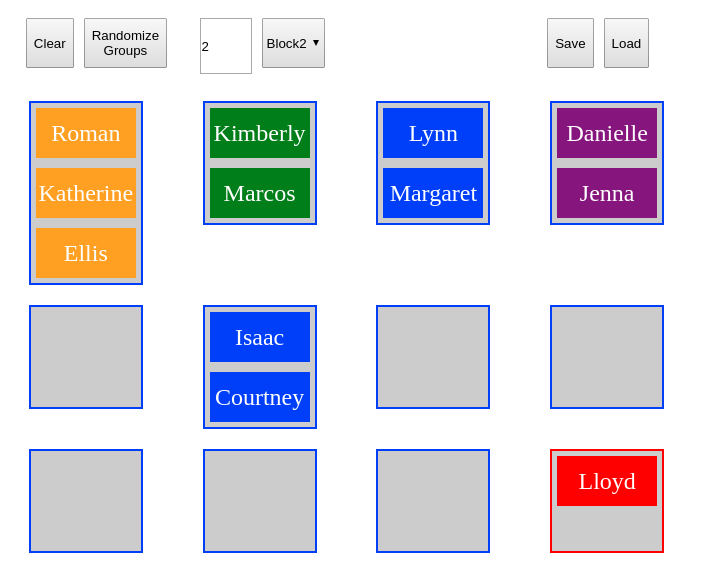

# grouping-tool

A simple tool for generating random groups from a list of names.

Usage:
 1. Save class lists in the directory, with one name per line
 2. Edit index.html, the selection class "classfile" to have one option for each list of names
 3. Open index.html in a browser.  
 4. Select the class you want to group, number of students per group, then "Randomize".
 5. Move student names to the bottom right if absent, rebalance groups by dragging names into different groups
 6. To save the current grouping, click "Save"
 7. To switch to a different class, hit clear, then go back to step 4.
 8. To load a previous grouping, click "Load" and navigate to the saved file.
 
Uses the muuri package to handle draggable grid boxes.

Also available on repl.it, https://repl.it/@MarkBetnel/Groups

